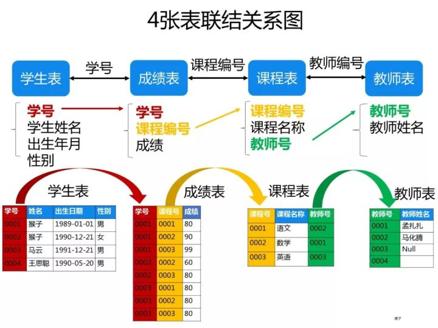

## 练习课（三）

#### 正则表达式练习

**1、匹配整数或者小数（包括正数和负数）**

自己：re.findall(r"-?[0-9]+\.?[0-9]*",s)
s = "alkfjsa-1,2,3.88,22"

　　**-?\d+(\.\d+)?**     答案不对
re.findall(r"-?\d+\.\d*\b","allaalafd1.23, 33,2")  老师讲的

　　　　-?表示-匹配0次或一次,\d表示整数,+表示匹配一次或多次,(\.\d+)?表示小数
**2、匹配年月日日期 格式2018-12-6**

自己：re.findall(r"[1-9]+[0-9]{3}-1?[0-]", s)   不对

　　**^[1-9]\d{0,3}-(1[0-2]|0?[1-9])-(3[01]|[12]\d|0?[1-9])$**

　　　　1**.**^[1-9]表示年是以数字1-9开头的,\d{0,3}表示年的位数,^[1-9]\d{0,3}就表示1-9999年之间

　　　　2.(1[0-2]|0?[1-9])中|前面的1[0-2]表示从10到12,后面的0?[1-9]表示01-09或者1-9,

　　　　　　(1[0-2]|0?[1-9])表示月,01-12或者1-12

　　　　3.(3[01]|[12]\d|0?[1-9])$其中3[01]表示30或31,[12]\d表示从10-29,最后的0?[1-9]表示从

　　　　　　01-09或者是从1-9.整体就表示从01-31或者1-31

**3、匹配qq号**

　　**[1-9]\d{4,11}**

　　　　表示5位到12位qq.第一位为非0

**4、11位的电话号码**

　　**1[3-9]\d{9}**

　　　　第一位数字为1,第二位为3-9,后面随便9位数
**5、长度为8-10位的用户密码 ： 包含数字字母下划线**

　　**\w{8,10}**

**6、匹配验证码：4位数字字母组成的**

　　**[\da-zA-Z]{4}或者[0-9a-zA-Z]{4}**

　　[ ]里面的表示数字,或者a-z或者A-Z,{4}表示4位
**7、匹配邮箱地址**

　　`[`0-9a-zA-Z][\w\-.]+@[a-zA-Z0-9\-]+(\.[a-zA-Z0-9\-]+)\*\.[A-Za-z0-9]{2,6}**

　　`[`0-9a-zA-Z][\w\-.]+**  @前面必须有内容且只能是字母(大小写),数字,下划线,减号,点

　　**[a-zA-Z0-9\-]+(\.[a-zA-Z0-9\-]+)\***  @和最后一个点之间必须有内容且只能是字母(大小写),数字,点,减号,且两个点不能挨着

　　**[A-Za-z0-9]{2,6}**  最后一个点之后必须有内容且内容只能是字母(大小写),数字长度为大于等于2,小于等于6
**8、从类似**

```
<a>wahaha</a>
<b>banana</b>
<h1>qqxing</h1>
```

**这样的字符串中，**
**1）匹配出wahaha，banana，qqxing内容。**

　　**\w{6}**

　　**>\w+<**
**2）匹配出a,b,h1这样的内容**

　　**<\w+>**

**9、1-2\*((60-30+(-40/5)\*(9-2\*5/3+7/3\*99/4\*2998+10\*568/14))-(-4\*3)/(16-3\*2))**
**1）从上面算式中匹配出最内层小括号以及小括号内的表达式**

```
　\([^()]+\)　　\(和\)表示前后位( ),[^()]就表示外面的()里面没有()
```


**10、从类似9-2\*5/3+7/3\*99/4\*2998+10\*568/14的表达式中匹配出从左到右第一个乘法或除法**

　　**\d+[\*/]\d+**　　[*/]前后的\d+表示*或/前面的整数,可能是多位数字,要加+

#### mysql面试题集锦


理清SQL语句的执行顺序


创建school数据库

```
create database school;
use school;
```

创建四张表

```
create table student(
    s_id varchar(10),
    s_name varchar(20),
    s_age date,
    s_sex varchar(10)
);

create table course(
    c_id varchar(10),
    c_name varchar(20),
    t_id varchar(10)
);


create table teacher (
t_id varchar(10),
t_name varchar(20)
);

create table score (
    s_id varchar(10),
    c_id varchar(10),
    score varchar(10)
);
```



往表里插值

```mysql
insert into student (s_id, s_name, s_age, s_sex)
values  ('01' , '赵雷' , '1990-01-01' , '男'),
        ('02' , '钱电' , '1990-12-21' , '男'),
        ('03' , '孙风' , '1990-05-20' , '男'),
        ('04' , '李云' , '1990-08-06' , '男'),
        ('05' , '周梅' , '1991-12-01' , '女'),
        ('06' , '吴兰' , '1992-03-01' , '女'),
        ('07' , '郑竹' , '1989-07-01' , '女'),
        ('08' , '王菊' , '1990-01-20' , '女');

insert into course (c_id, c_name, t_id)
values  ('01' , '语文' , '02'),
        ('02' , '数学' , '01'),
        ('03' , '英语' , '03');

insert into teacher (t_id, t_name)
values  ('01' , '张三'),
        ('02' , '李四'),
        ('03' , '王五');

insert into score (s_id, c_id, score)
values  ('01' , '01' , 80),
        ('01' , '02' , 90),
        ('01' , '03' , 99),
        ('02' , '01' , 70),
        ('02' , '02' , 60),
        ('02' , '03' , 80),
        ('03' , '01' , 80),
        ('03' , '02' , 80),
        ('03' , '03' , 80),
        ('04' , '01' , 50),
        ('04' , '02' , 30),
        ('04' , '03' , 20),
        ('05' , '01' , 76),
        ('05' , '02' , 87),
        ('06' , '01' , 31),
        ('06' , '03' , 34),
        ('07' , '02' , 89),
        ('07' , '03' , 98);
```


创建一张总总表

```csharp
create table total(
select a.s_id as s_id,a.s_name as s_name,a.s_age as s_age,a.s_sex as s_sex,
b.c_id as c_id,b.score as score,c.t_id as t_id,d.t_name as t_name
from student a
left join
score  b on a.s_id=b.s_id
left join
course c on b.c_id=c.c_id
left join
teacher d on c.t_id=d.t_id
);
select * from total;
```

(17  18  19  20  22  23  24  25)没学过
(46  47  48  49)

# 1、查询"01"课程比"02"课程成绩高的学生的信息及课程分数

```mysql
自己：没写出来
select student.s_id,student.s_name,student.s_age,student.s_sex,score.score from student,score where 

```


```csharp
select a.s_id as s_id,score1,score2 from
(select s_id, score as score1 from score where c_id='01') a
inner join
(select s_id, score as score2 from score where c_id='02') b
on a.s_id=b.s_id
where score1>score2;
```


# 2、查询"01"课程比"02"课程成绩低的学生的信息及课程分数

```csharp
select a.s_id as s_id,score1,score2 from
(select s_id, score as score1 from score where c_id='01') a
inner join
(select s_id, score as score2 from score where c_id='02') b
on a.s_id=b.s_id
where score1<score2;
```


# 3、查询平均成绩大于等于60分的同学的学生编号和学生姓名和平均成绩

```mysql
自己：
select        from (select s_id,avg(score) from )
```


```csharp
select student.s_id as s_id,student.s_name as s_name,b.avg_score as avg_score from student 
right join 
(select s_id,avg(score) as avg_score from score
group by s_id having avg_score>60) b
on student.s_id=b.s_id;
```


# 4、查询平均成绩小于60分的同学的学生编号和学生姓名和平均成绩

```csharp
select student.s_id as s_id,student.s_name as s_name,b.avg_score as avg_score from student 
right join 
(select s_id,avg(score) as avg_score from score
group by s_id having avg_score<60) b
on student.s_id=b.s_id;
```


# 5、查询所有同学的学生编号、学生姓名、选课总数、所有课程的总成绩

```
自己：
select student.s_id,student.s_name,sum(c_id)
```


```csharp
select s_id, s_name, count(c_id) as c_num, sum(score) as total_score
from total
group by s_id ;
```

# 6、查询"李"姓老师的数量

```
自己：
select count(*) from teacher where t_name  like  "李%";

```

```csharp
select count(t_name) from teacher
where t_name like '李%';
```


# 7、查询学过"张三"老师授课的同学的信息

```
自己：正确
select s_id,s_name,s_age,s_sex from total where t_name = "张三";
```

```csharp
select distinct s_id,s_name,s_age,s_sex
from total
where t_name='张三';
```

# 8、查询没学过"张三"老师授课的同学的信息

```
自己：错误
select s_id,s_name,s_age,s_sex from total where t_name != "张三";
```


```csharp
select * from student
where s_id not in
(select distinct s_id
from total
where t_name='张三');
```


# 9、查询学过编号为"01"并且也学过编号为"02"的课程的同学的信息

```mysql
自己：
select   *  from student where s_id in (select s_id from score where c_id = "01" ) and s_id in (select s_id from score where c_id = "02"); 
```

```mysql
select * from student
where s_id in
(select s_id from score where c_id='01')
and s_id in
(select s_id from score where c_id='02');
```


# 10、查询学过编号为"01"但是没有学过编号为"02"的课程的同学的信息

```csharp
select * from student
where s_id in
(select s_id from score where c_id='01')
and s_id not in
(select s_id from score where c_id='02');
```


# 11、查询没有学全所有课程的同学的信息

```mysql
自己：
全都学了的学生信息：
select * from student where s_id in (select s_id from score where c_id = "01") and s_id in (select s_id from score where c_id ="02") and s_id in (select s_id from score where c_id ="03");
没有学全所有课程的同学：

```


```csharp
select s.s_id,s.s_name,s.s_age,s.s_sex from student as s inner join (select s_id from total group by s_id having count(c_id) < 3) as t on s.s_id = t.s_id;

# 同学的方法
select * from student where s_id in (select s_id from total group by s_id having count(c_id) <3);
```


# 12、查询至少有一门课与学号为"01"的同学所学相同的同学的信息

思路：先找出‘01’同学学过的c_id，再找出学过任一门的s_id，再根据s_id在student找学生信息。

```csharp
select * from student
where s_id in
(select distinct s_id from score
where c_id in
(select c_id from score where s_id='01'));
```


# 13、查询和"01"号的同学学习的课程完全相同的其他同学的信息


思路：先找学过‘01’同学学过的课程的学生，然后通过group by找这些人里面学的课程数和‘01’相同的人。比如下面，表a是‘01’同学学过的课程，b则是所有学过‘01’同学学过的任一门课程的人。

```csharp
select * from student
where s_id in
(select s_id from
(select score.s_id,a.c_id from 
(select c_id from score where s_id='01') a 
inner join  score
on a.c_id=score.c_id) b
where s_id<>'01' 
group by s_id having count(c_id)=
(select count(c_id) from score where s_id='01'));
```


# 14、查询没学过"张三"老师讲授的任一门课程的学生姓名

```mysql 
自己：
思路：先找到张三老师的所有课程，
select c_id from total where t_name = "张三";     02
也就是没学过02 课程的同学的信息
select  distinct  s_name    from total where c_id not in "02";


正确的思路：
先找到total表中所有学过“张三”老师可的同学，然后再在student中找到，不在学过张三老师课的同学
```


```csharp
select s_id,s_name from student
where s_id not in
(select distinct s_id from total
where t_name='张三');
```


# 15、查询两门及其以上不及格课程的同学的学号，姓名及其平均成绩


思路：先找不及格超过两门的s_id，为表a，再根据表a连接学生信息表student和平均分表b。

```csharp
select a.s_id,student.s_name,b.avg_score from
(select s_id from score
where score<60
group by s_id having count(*)>=2) a
left join
student on a.s_id=student.s_id
left join
(select s_id,avg(score) as avg_score
from score
group by s_id) b
on a.s_id=b.s_id;
```


# 16、检索"01"课程分数小于60，按分数降序排列的学生信息

```
自己：
select  distinct s_id,s_name,s_age,s_sex,score  from total where s_id in  (select s_id from total where c_id = "01" and score < 60) order by score desc ; 
```


```csharp
select a.s_id,student.s_name,student.s_age,student.s_sex,a.score from
(select s_id,score from score
where c_id='01' and score<60
order by score desc) a
left join student on a.s_id=student.s_id;
```


# 17、按平均成绩从高到低显示所有学生的所有课程的成绩以及平均成绩

```csharp
select s_id as '学号',
sum(case c_id when '01' then score else 0 end) as '语文',
sum(case c_id when '02' then score else 0 end) as '数学',
sum(case c_id when '03' then score else 0 end) as '英语',
avg(score) as '平均成绩'
from score
group by s_id
order by '平均成绩' desc;
```


# 18、查询各科成绩最高分、最低分和平均分：以如下形式显示：课程ID，课程name，最高分，最低分，平均分，及格率，中等率，优良率，优秀率

## ----及格为>=60，中等为：70-80，优良为：80-90，优秀为：>=90

```jsx
select a.c_id as '课程ID',course.c_name as '课程name',
max(a.score) as '最高分',min(a.score) as '最低分',
cast(avg(a.score) as decimal(5,2)) as '平均分',
concat(cast(sum(pass)/count(*)*100 as decimal(5,2)),'%') as '及格率',
concat(cast(sum(medi)/count(*)*100 as decimal(5,2)),'%') as '中等率',
concat(cast(sum(good)/count(*)*100 as decimal(5,2)),'%') as '优良率',
concat(cast(sum(excellent)/count(*)*100 as decimal(5,2)),'%') as '优秀率' from
(select * ,
case when score>=60 then 1 else 0 end as pass,
case when score>=70 and score<80 then 1 else 0 end as medi,
case when score>=80 and score<90 then 1 else 0 end as good,
case when score>=90 then 1 else 0 end as excellent
from score) a
left join course on a.c_id=course.c_id
group by a.c_id;
```


# 19、按各科成绩进行排序，并显示排名

```csharp
select a.*,@rank:=@rank+1 as rank from
(select c_id,sum(score) as '成绩' from score
group by c_id order by sum(score) desc) a,
(select @rank:=0) b;
```


# 20、查询学生的总成绩并进行排名

```csharp
select a.*,@rank:=@rank+1 as rank from 
(select s_id,sum(score) as '总成绩' from score
group by s_id order by sum(score) desc) a,
(select @rank:=0) b;
```


# 21、查询不同老师所教不同课程平均分从高到低显示

```
自己：

```

```csharp
select t_id,t_name,c_id,avg(score) as avg_score 
from total
group by t_id,c_id
order by avg_score desc;
```


# 22、查询所有课程的成绩第2名到第3名的学生信息及该课程成绩

先得到一张每门课程的成绩排序表

```csharp
select c_id,s_id,score from score 
group by c_id,s_id order by c_id,score desc;
```


添加两个辅助变量用来生成分组排名

```kotlin
select *,if(@pa=a.c_id,@rank:=@rank+1,@rank:=1) AS rank,@pa:=a.c_id
from
(select c_id,s_id,score from score 
group by c_id,s_id order by c_id,score desc) a,
(select @rank:=0,@pa:=NULL) b;
```


选出排名为2-3名与student表连接查询

```csharp
select result.c_id,result.s_id,result.score,
student.s_name,student.s_age,student.s_sex from
(select *,if(@pa=a.c_id,@rank:=@rank+1,@rank:=1) AS rank,@pa:=a.c_id
from
(select c_id,s_id,score from score 
group by c_id,s_id order by c_id,score desc) a,
(select @rank:=0,@pa:=NULL) b) result
left join student on result.s_id=student.s_id
where rank between 2 and 3
group by c_id,score desc;
```


这样写其实也是有问题的，就是没有考虑分数相同的人

# 23、统计各科成绩各分数段人数：课程编号,课程名称,[100-85],[85-70],[70-60],[0-60]及所占百分比

```csharp
select a.c_id as '课程编号',course.c_name as '课程名称',
sum(level1) as '[100-85]人数', sum(level1)/count(1) as '[100-85]占比',
sum(level2) as '[85-70]人数', sum(level2)/count(1) as '[85-70]占比',
sum(level3) as '[70-60]人数', sum(level3)/count(1) as '[70-60]占比',
sum(level4) as '[0-60]人数', sum(level4)/count(1) as '[0-60]占比' from
(select *,
(case when score between 85 and 100 then 1 else 0 end) as 'level1',
(case when score between 70 and 84 then 1 else 0 end) as 'level2',
(case when score between 60 and 69 then 1 else 0 end) as 'level3',
(case when score between 0 and 59 then 1 else 0 end) as 'level4'
from score) a
left join course on a.c_id=course.c_id
group by a.c_id;
```


# 24、查询学生平均成绩及其名次

```csharp
select a.*,@rank:=@rank+1 as rank from 
(select s_id,avg(score) as '平均成绩' from score
group by s_id order by avg(score) desc) a,
(select @rank:=0) b;
```


# 25、查询各科成绩前三名的记录

```csharp
select a.c_id,a.s_id,a.score 
from score as a 
where (select count(b.s_id) from score as b where a.c_id=b.c_id and a.score<b.score)<3 
group by a.c_id,a.s_id; 
```


# 26、查询每门课程被选修的学生数

```csharp
select c_id,count(s_id) as '选修人数' 
from score group by c_id; 
```


# 27、查询出只有两门课程的全部学生的学号和姓名


```csharp
select student.* from
(select s_id from score
group by s_id having count(c_id)=2) a
left join student on a.s_id=student.s_id;
```


# 28、查询男生、女生人数

```csharp
select s_sex as '性别',count(1) as '人数'
from student group by s_sex;
```


# 29、查询名字中含有"风"字的学生信息

```csharp
select * from student
where s_name like '%风%';
```


# 30、查询同名同姓学生名单，并统计同名人数

```csharp
select distinct s_name,num as '同名人数' from student,
(select *,count(s_id)-1 as num 
from student group by s_name) a;
```


# 31、查询1990年出生的学生名单(注：Student表中Sage列的类型是datetime)

```csharp
select s_name from student where year(s_age)='1990';
```


# 32、查询每门课程的平均成绩，结果按平均成绩降序排列，平均成绩相同时，按课程编号

```csharp
select c_id,avg(score) as '平均成绩'
from score group by c_id
order by 平均成绩 desc,c_id;
```


# 33、查询平均成绩大于等于85的所有学生的学号、姓名和平均成绩

```csharp
select a.s_id,s_name,avg_score from 
(select s_id,avg(score) as avg_score from score
group by s_id having avg(score)>=85) a
left join student on a.s_id=student.s_id;
```


image.png

# 34、查询课程名称为"数学"，且分数低于60的学生姓名和分数

```csharp
select s_name,c_name,score from total
where c_name='数学' and score<60;
```


# 35、查询所有学生的课程及分数情况

```csharp
select s_id,
sum(case when c_id='01' then score else 0 end) as '语文',
sum(case when c_id='02' then score else 0 end) as '数学',
sum(case when c_id='03' then score else 0 end) as '英语'
from total
group by s_id;
```


# 36、查询任何一门课程成绩在70分以上的姓名、课程名称和分数

```csharp
select s_name,c_name,score
from total where score>70;
```


# 37、查询不及格的课程

```csharp
select score.c_id,course.c_name,score
from score left join course
on score.c_id=course.c_id
where score<60;
```


# 38、查询课程编号为01且课程成绩在80分以上的学生的学号和姓名

```csharp
select student.s_id,s_name from student
right join score on student.s_id=score.s_id
where c_id='01' and score>80;
```

因为‘01’课程最高分为80，所以查询结果为空。

# 39、求每门课程的学生人数

```csharp
select c_id,count(1) as '选课人数'
from score group by c_id;
```


# 40、查询选修"张三"老师所授课程的学生中，成绩最高的学生信息及其成绩

```csharp
select student.*,a.score from
(select s_id,score
from total where t_name='张三'
order by score desc limit 1) a
left join student on a.s_id=student.s_id;
```


# 41、查询不同课程成绩相同的学生的学生编号、课程编号、学生成绩

```csharp
select a.s_id,a.c_id,a.score
from score a,score b
where a.c_id=b.c_id and a.s_id<>b.s_id and a.score=b.score;
```


# 42、查询每门功成绩最好的前两名

```csharp
(select c_id,s_id from score where c_id='01' order by score limit 2)
union
(select c_id,s_id from score where c_id='02' order by score limit 2)
union
(select c_id,s_id from score where c_id='03' order by score limit 2);
```


# 43、统计每门课程的学生选修人数（超过5人的课程才统计）。要求输出课程号和选修人数，查询结果按人数降序排列，若人数相同，按课程号升序排列

```csharp
select c_id,count(s_id) as 选修人数 from score
group by c_id having 选修人数>5
order by 选修人数 desc,c_id;
```


# 44、检索至少选修两门课程的学生学号

```csharp
select s_id from score group by s_id having count(c_id)>=2;
```


# 45、查询选修了全部课程的学生信息

```csharp
select * from student
where s_id in
(select s_id from score
group by s_id having count(c_id)=(select count(*) from course));
```


# 46、查询各学生的年龄

```csharp
select s_id,s_name,(year(now())-year(s_age)) as '年龄' from student;
```


# 47、查询本周过生日的学生

思路：找到这周的起始日期(一周的开始从周日算起)

```csharp
select s_name,s_age from student
where date_format(s_age,'2019-%m-%d') 
between adddate(curdate(),-(date_format(now(),'%w')))
and adddate(curdate(),7-date_format(now(),'%w'));
```

因为没有人这周过生日，因此查询记录为空

# 48、查询下周过生日的学生

```csharp
select s_name,s_age from student
where date_format(s_age,'2019-%m-%d') 
between adddate(curdate(),7-(date_format(now(),'%w')))
and adddate(curdate(),14-date_format(now(),'%w'));
```

没人下周过生日，查询记录同样为空

# 49、查询本月过生日的学生

```csharp
select s_name,s_age from student
where date_format(s_age,'%m')=date_format(now(),'%m');
```


# 50、查询下月过生日的学生

```csharp
select s_name,s_age from student
where date_format(s_age,'%m')=date_format(now(),'%m')+1;
```


#### 中期项目设计

第三阶段前端上完了交项目

图形化界面：pyqt,pygame,tkinter

获得高分的两点：

１．用到了课上没有学过的知识点，这样才能获得高分

２．有一些创新点，比如逻辑创新，有生产力的，或者自己写一个牛逼的算法


​     


